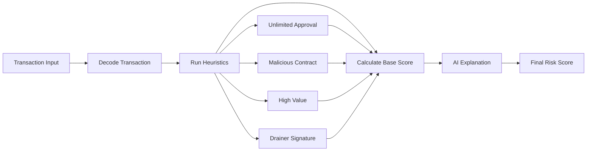
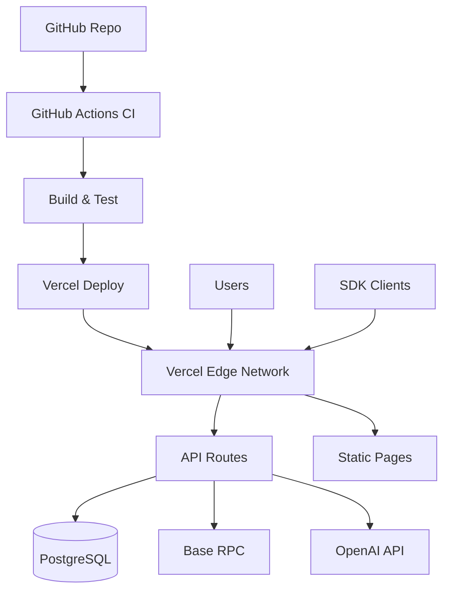

# BasedOnchain Architecture

## Overview

BasedOnchain is a monorepo application built with Next.js 14, providing transaction analysis services for the Base blockchain. The architecture follows a serverless-first approach optimized for deployment on Vercel.

## System Architecture

```mermaid
flowchart TB
    subgraph Client["Client Layer"]
        Browser[Web Browser]
        Wallet[MetaMask/Coinbase Wallet]
        SDK[SDK Clients]
    end

    subgraph Frontend["Next.js Frontend"]
        Pages[App Router Pages]
        Components[React Components]
        Hooks[Custom Hooks]
    end

    subgraph API["API Routes (Serverless)"]
        AnalyzeAPI[/api/analyze]
        SimulateAPI[/api/simulate]
        MetricsAPI[/api/metrics]
        AnalysesAPI[/api/analyses]
    end

    subgraph Services["Core Services"]
        TxDecoder[Transaction Decoder]
        RiskEngine[Risk Engine]
        Heuristics[Heuristics Engine]
        Simulation[Simulation Engine]
        AIService[OpenAI Service]
    end

    subgraph External["External Services"]
        BaseRPC[Base RPC Node]
        OpenAI[OpenAI API]
        Vercel[Vercel Platform]
    end

    subgraph Data["Data Layer"]
        Postgres[(PostgreSQL)]
        Prisma[Prisma ORM]
    end

    Browser --> Wallet
    Browser --> Pages
    Wallet --> Pages
    SDK --> AnalyzeAPI
    Pages --> Components
    Components --> Hooks
    Pages --> AnalyzeAPI

    AnalyzeAPI --> TxDecoder
    AnalyzeAPI --> RiskEngine
    SimulateAPI --> Simulation
    MetricsAPI --> Postgres
    AnalysesAPI --> Postgres

    RiskEngine --> Heuristics
    RiskEngine --> Simulation
    RiskEngine --> AIService

    TxDecoder --> BaseRPC
    Simulation --> BaseRPC
    AIService --> OpenAI

    AnalyzeAPI --> Postgres
    Postgres --> Prisma

    Frontend --> Vercel
    API --> Vercel
```

## Data Flow

### Transaction Analysis Flow

1. **Input**: User submits transaction (txHash, calldata, or unsigned tx)
2. **Decode**: Transaction decoder parses calldata using ethers.js
3. **Heuristics**: Risk engine runs multiple heuristics:
   - Unlimited approval checks
   - Known malicious contract detection
   - Value transfer thresholds
   - Function signature analysis
   - NFT approval risks
4. **Simulate**: Runs `eth_call` to simulate transaction execution
5. **AI Analysis**: OpenAI generates human-readable explanation
6. **Store**: Analysis saved to PostgreSQL via Prisma
7. **Response**: Returns risk score, explanation, and recommendations

### Risk Scoring Algorithm



## Component Descriptions

### Frontend (`apps/web/`)

**Pages (App Router)**
- `/` - Landing page with features and CTA
- `/analyze` - Transaction analysis interface
- `/dashboard` - User dashboard with metrics and history

**Components**
- `WalletConnect` - RainbowKit wallet connection with Base detection
- `TxCard` - Displays analysis results with risk badge
- `RiskBadge` - Visual risk indicator (Low/Medium/High/Critical)
- `TransactionDecoder` - Human-readable transaction display
- `AnalysisList` - List of past analyses

**Hooks**
- `useWallet` - Wallet connection state management
- `useAnalyses` - Fetch and manage analyses

### API Routes (`apps/web/app/api/`)

**POST /api/analyze**
- Main analysis endpoint
- Validates input with Zod
- Rate limited (10 req/min per IP)
- Returns complete analysis with risk score

**POST /api/simulate**
- Standalone simulation endpoint
- Returns state diffs and value at risk

**GET /api/metrics**
- KPI dashboard endpoint
- Returns: txs analyzed, warnings, high risk count

**GET /api/analyses**
- List analyses for a wallet
- Supports pagination

**GET /api/approvals/:walletAddress**
- Scan ERC20 approvals (requires event indexing for full implementation)

**POST /api/revoke/prepare**
- Prepare unsigned revoke transaction

### Core Libraries (`apps/web/lib/`)

**Transaction Decoder** (`txDecoder.ts`)
- Decodes ERC20/ERC721 function calls
- Generates human-readable summaries
- Handles multiple input formats (txHash, calldata, unsigned tx)

**Risk Engine** (`riskEngine/`)
- **Heuristics** (`heuristics.ts`): Rule-based risk checks
- **Simulation** (`simulation.ts`): eth_call simulation and state analysis

**AI Service** (`ai.ts`)
- OpenAI integration
- Structured prompts for explanations
- Output sanitization
- Fallback heuristics-based explanations

**Ethers Integration** (`ethers.ts`)
- Base RPC provider setup
- Transaction fetching
- Network utilities

### Database Schema (`prisma/schema.prisma`)

**Models:**
- `User` - User accounts (optional, for future auth)
- `Wallet` - Wallet addresses
- `Analysis` - Transaction analysis results

**Relationships:**
- User has many Wallets
- Wallet has many Analyses

### Shared Types (`packages/shared/`)

Common TypeScript types used across frontend and API:
- `RiskScore`, `RiskLevel`
- `TransactionInput`
- `DecodedTransaction`
- `AnalysisResult`
- `ApiResponse`

### SDK (`packages/sdk/`)

JavaScript/TypeScript SDK for external integrations:
- `analyzeTx()` - Analyze transactions
- `simulateTx()` - Simulate transactions
- `getAnalyses()` - Fetch wallet analyses

## Technology Stack

### Frontend
- **Next.js 14** - React framework with App Router
- **TypeScript** - Type safety
- **Tailwind CSS** - Styling
- **Wagmi + RainbowKit** - Wallet connectivity (current)
- **OnchainKit** - Coinbase's React/TypeScript toolkit (planned for Milestone B)
- **React Query** - Data fetching

### Backend
- **Next.js API Routes** - Serverless API endpoints
- **Prisma** - Database ORM
- **PostgreSQL** - Relational database
- **Zod** - Runtime validation

### Blockchain
- **ethers.js v6** - Ethereum/Base interaction
- **Base RPC** - Network access

### AI/ML
- **OpenAI API** - Risk explanations
- **Custom Heuristics** - Rule-based scoring

### Infrastructure
- **Vercel** - Hosting and deployment
- **GitHub Actions** - CI/CD
- **PostgreSQL** (Supabase/Neon/Railway) - Database hosting

## Security Architecture

### Input Validation
- All API inputs validated with Zod schemas
- Address format validation
- Calldata sanitization

### Rate Limiting
- 10 requests per minute per IP (in-memory for MVP)
- Future: Redis/Upstash for distributed rate limiting

### Secrets Management
- Environment variables for sensitive data
- No secrets in code or version control
- Vercel environment variables for deployment

### LLM Safety
- Output sanitization to prevent XSS
- Structured prompts to reduce hallucinations
- Fallback to heuristics if AI fails

### Database Security
- Prisma parameterized queries (SQL injection protection)
- Row-level security (future: user isolation)

## Deployment Architecture



## Future Architecture Considerations

### Scaling
- Move rate limiting to Redis/Upstash
- Add caching layer (Redis) for frequent queries
- Consider edge functions for simulation
- Queue system (BullMQ) for heavy analysis

### Monitoring
- Sentry for error tracking
- Vercel Analytics
- Custom metrics dashboard
- Log aggregation

### Features
- Event indexing for approval scanning
- Webhook system for async processing
- Browser extension architecture
- Mobile app support
